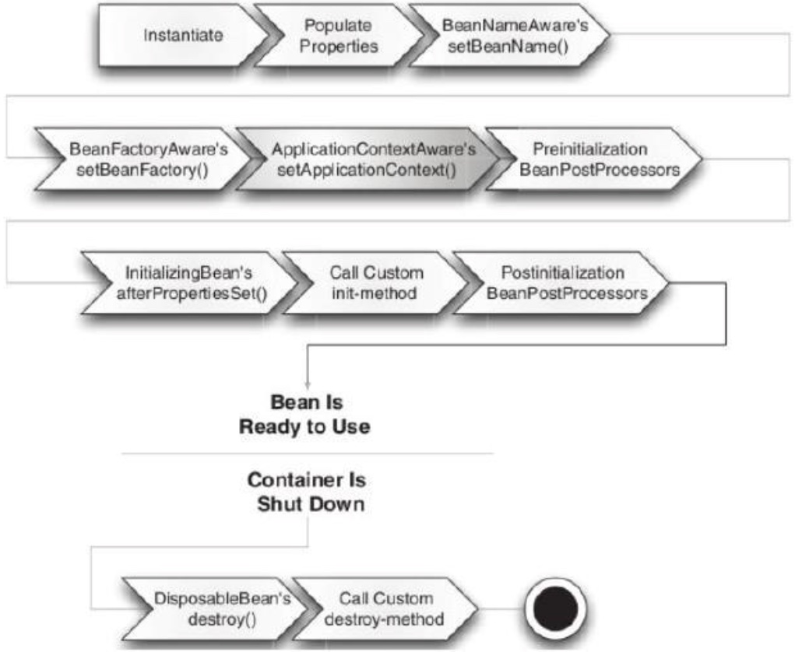
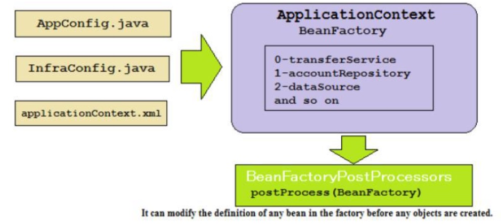

---

title: Spring Container Dependency and IOC

---

* [What is dependency injection and what are the advantages of using it?](#what-is-dependency-injection-and-what-are-the-advantages-of-using-it)
* [What is an interface and what are the advantages of making use of them in Java?](#what-is-an-interface-andwhat-are-the-advantages-of-making-use-of-them-in-java)
* [What is an ApplicationContext?](#what-is-an-applicationcontext)
* [How are you going to create a new instance of an ApplicationContext?](#how-are-you-going-to-create-a-new-instance-of-an-applicationcontext)
* [Can you describe the lifecycle of a Spring Bean in an ApplicationContext?](#can-you-describe-the-lifecycle-of-a-spring-bean-in-an-applicationcontext)
* [How are you going to create an ApplicationContext in an integration test?](#how-are-you-going-to-create-an-applicationcontext-in-an-integration-test)
    * [Web Application Context](#web-application-context)
* [What is the preferred way to close an application context? Does Spring Boot do this for you?](#what-is-the-preferred-way-to-close-an-application-context-does-spring-boot-do-this-for-you)
    * [Web Application](#web-application)
    * [Spring Boot Closing Application Context](#spring-boot-closing-application-context)
* [Are beans lazily or eagerly instantiated by default? How do you alter this behavior?](#are-beans-lazily-or-eagerly-instantiated-by-default-how-do-you-alter-this-behavior)
* [What is a property source? How would you use @PropertySource?](#what-is-a-property-source-how-would-you-use-propertysource)
* [What is a BeanFactoryPostProcessor and what is it used for? When is it invoked?](#what-is-a-beanfactorypostprocessor-and-what-is-it-used-for-when-is-it-invoked)
* [What is a BeanPostProcessor and how is it different to a BeanFactoryPostProcessor? What do they do? When are they called?](#what-is-a-beanpostprocessor-and-how-is-it-different-to-a-beanfactorypostprocessor-what-do-they-do-when-are-they-called)
* [What does component-scanning do?](#what-does-component-scanning-do)
* [What is the behavior of the annotation @Autowired with regards to field injection, constructor injection and method injection?](#what-is-the-behavior-of-the-annotation-autowired-with-regards-to-field-injection-constructor-injection-and-method-injection)
* [How does the @Qualifier annotation complement the use of @Autowired?](#how-does-the-qualifier-annotation-complement-the-use-of-autowired)
* [What is a proxy object and what are the two different types of proxies Spring can create?](#what-is-a-proxy-object-and-what-are-the-two-different-types-of-proxies-spring-can-create)
* [What does the @Bean annotation do?](#what-does-the-bean-annotation-do)
* [What is the default bean id if you only use @Bean? How can you override this?](#what-is-the-default-bean-id-if-you-only-use-bean-how-can-you-override-this)
* [Why are you not allowed to annotate a final class with @Configuration](#why-are-you-not-allowed-to-annotate-a-final-class-with-configuration)
* [How do you configure profiles? What are possible use cases where they might be useful?](#how-do-you-configure-profiles-what-are-possible-use-cases-where-they-might-be-useful)
* [Can you use @Bean together with @Profile?](#can-you-use-bean-together-with-profile)
* [Can you use @Component together with @Profile?](#can-you-use-component-together-with-profile)
* [How many profiles can you have?](#how-many-profiles-can-you-have)
* [How do you inject scalar/literal values into Spring beans?](#how-do-you-inject-scalarliteral-values-into-spring-beans)
* [What is Spring Expression Language (SpEL for short)?](#what-is-spring-expression-language-spel-for-short)
* [What is the Environment abstraction in Spring?](#what-is-the-environment-abstraction-in-spring)
* [Where can properties in the environment come from – there are many sources for properties – check the documentation if not sure. Spring Boot adds even more.](#where-can-properties-in-the-environment-come-from--there-are-many-sources-for-properties--check-the-documentation-if-not-sure-spring-boot-adds-even-more)
* [What can you reference using SpEL?](#what-can-you-reference-using-spel)
* [What is the difference between $ and # in @Value expressions?](#what-is-the-difference-between--and--in-value-expressions)


## What is dependency injection and what are the advantages of using it?

Dependency injection is a design pattern that promotes loose coupling between the Spring components – that is, between the different collaborating POJOs. So by applying DI to your complex programming, your code will become simpler, easier to understand, and easier to test.
According to the DI pattern, dependent objects are given their dependencies at the time of creation of the objects by some factory or third party. This means that we have to focus on defining the dependencies instead of resolving the dependencies of collaborating objects in the enterprise application.
Advantages:
- Reduced coupling between the parts of the application
- Increase cohesion of the parts of the application
- Increased testability.
- Better design of applications when using dependency injection.
- Increased reusability.
- Increased maintainability.
- Standardizes parts of application development.
- Reduces boilerplate code

## What is an interface and what are the advantages of making use of them in Java?

A Java (Java 8 and later) interface is a reference that can contain the following:
- Constants
- Method signatures (these are methods that have no implementation)
- Default methods. A method with an implementation that, if not implemented in a class that implements the interface, will be used as a default implementation of the method in question. This can be useful when adding new method(s) to an interface and not wanting to modify all the classes that implement the interface.
- Private methods
- Static methods (static methods with implementation)
- Nested types (such nested type can be an enumeration).
Advantages of an interface:
- Allows for decoupling of a contract and its implementation(s).
- Allows for modularization of Java programs.
- Allowing for handling of groups of object in a similar fashion. For example, all
objects of classes implementing the java.util.List Java interface can be used in the
same way.
- Increase testability. Using interface types when referencing other objects make it easy
to replace such references with mock or stub objects that implement the same interface(s).

## What is an ApplicationContext?

In the Spring Framework, the org.springframework.beans.factory.BeanFactory interface provides the bean factory, which is a Spring IoC container. The bean factory is merely an object pool where objects are created and managed by configuration.
The interface org.springframework.context.ApplicationContext is simply a wrapper of the bean factory, providing some extra application context services, such as support for AOP and, hence, declarative transaction, security, and instrumentation support such as support for message resources required for internationalization, and the ability to publish application events to interested event listeners.
There can be more than one application context in a single Spring application. Multiple application contexts can be arranged in a parent-child hierarchy where the relation is directional from child context to parent context. Many child contexts can have one and the same parent context.

## How are you going to create a new instance of an ApplicationContext?

Spring provides several flavours of application context as a bean container. There are multiple core implementations of the ApplicationContext interface:

- FileSystemXmlApplicationContext
- ClassPathXmlApplicationContext
- AnnotationConfigApplicationContext

Spring provides you with a web-aware implementation of the ApplicationContext interface, as shown here:

- XmlWebApplicationContext
- AnnotationConfigWebApplicationContext

ApplicationContext context = new FileSystemXmlApplicationContext("c:/knight.xml"); ApplicationContext context = new ClassPathXmlApplicationContext("knight.xml");
ApplicationContext context = new AnnotationConfigApplicationContext( com.springinaction.knights.config.KnightConfig.class);

## Can you describe the lifecycle of a Spring Bean in an ApplicationContext?



1. Load all bean definitions, creating an ordered graph.
2. Instantiate and run BeanFactoryPostProcessors (you can update bean definitions here).
3. Instantiate each bean.
4. Spring injects the values and bean references into the beans' properties.
5. Spring passes the ID of the bean to the setBeanName() method of the BeanNameAware interface if any bean implements it.
6. Spring passes the reference of the bean factory itself to the setBeanFactory() method of BeanFactoryAware if any bean implements it.
7. Spring passes the reference of the application context itself to the setApplicationContext() method of ApplicationContextAware if any bean implements it.
8. BeanPostProcessor is an interface, and Spring allows you to implement it with your bean, and modifies the instance of the bean before the initializer is invoked in the Spring bean container by calling its postProcessBeforeInitialization().
9. If your bean implements the InitializingBean interface, Spring calls its afterPropertiesSet() method to initialize any process or loading resource for your application. There are other methods to achieve this step, for example, you can use the init-method of the <bean> tag, the initMethod attribute of the @Bean annotation, and JSR 250's @PostConstruct annotation.
10. BeanPostProcessor is an interface, and spring allows you to implement it with your bean. It modifies the instance of the bean after the initializer is invoked in the spring bean container by calling its postProcessAfterInitialization().
11. Now your bean is ready to use in the step, and your application can access this bean by using the getBean() method of the application context. Your beans remain live in the application context until it is closed by calling the close() method of the application context.
12. If your bean implements the DisposibleBean interface, Spring calls its destroy() method to destroy any process or clean up the resources of your application. There are other methods to achieve this step-for example, you can use the destroy-method of the <bean> tag, the destroyMethod attribute of the @Bean annotation, and JSR 250's @PreDestroy annotation.

## How are you going to create an ApplicationContext in an integration test?

Depending on whether JUnit 4 or JUnit 5 is used, the annotation **@RunWith (JUnit 4)** or **@ExtendWith (JUnit 5)** is used to annotate the test-class. In addition, the annotation **@ContextConfiguration** in both cases to specify either the XML configuration file(s) or the Java class(es) containing the Spring configuration to be loaded into the application context for the test.
**JUnit 4**
```java
@RunWith(SpringRunner.class)
@ContextConfiguration(classes=MyConfiguration.class)
public class JUnit4SpringTest {
    @Autowired
    protected MyBean myBean;
    @Autowired
    protected ApplicationContext applicationContext;
}
```

**JUnit 5**

```java
@SpringJUnitConfig(classes=MyConfiguration.class)
public class JUnit5SpringTest {
```

**SpringJUnitConfig** combines these 2 annotations:
**@ExtendWith(SpringExtension.class) from JUnit 5 to run the test with the
SpringExtension Class and @ContextConfiguration from Spring Testing to load the Spring context.

### Web Application Context
**JUnit 4**
@RunWith(SpringRunner.class) + @ContextConfiguration + @WebAppConfiguration
**JUnit 5**
@SpringJUnitWebConfig combines the same annotations of @SpringJUnitConfig plus the @WebAppConfiguration

## What is the preferred way to close an application context? Does Spring Boot do this for you?

In a standalone non-web Spring application, there are two ways by which the Spring application context can be closed:
- Registering a shutdown-hook by calling the method registerShutdownHook, also implemented in the AbstractApplicationContext class. This is recommended way
- Calling the close method from the AbstractApplicationContext class.

### Web Application

In a web application, closing of the Spring application context is taken care of by the ContextLoaderListener, which implements the ServletContextListener interface. The ContextLoaderListener will receive a ServletContextEvent when the web container stops the web application.

### Spring Boot Closing Application Context

Spring Boot will register a shutdown-hook as described above when a Spring application that uses Spring Boot is started. The mechanism described above with the ContextLoaderListener also applies to Spring Boot web applications.

## Are beans lazily or eagerly instantiated by default? How do you alter this behavior?

**Singleton** Spring beans in an application context are **eagerly initialized** by default, as the application context is created.
An instance of a **prototype** scoped bean is typically **created lazily** when requested.
To explicitly set whether beans are to be lazily or eagerly initialized, the **@Lazy annotation** can be applied either to:
- Methods annotated with the @Bean annotation. Bean will be lazy or not as specified by the boolean parameter to the @Lazy annotation (default value is true).
- Classes annotated with the @Configuration annotation. All beans declared in the configuration class will be lazy or not as specified by the boolean parameter to the @Lazy annotation (default value is true).
- Classes annotated with @Component or any related stereotype annotation. The bean created from the component class will be lazy or not as specified by the boolean parameter to the @Lazy annotation (default value is true).

## What is a property source? How would you use @PropertySource?

What is a property source?
A property source in Spring’s environment abstraction represents a source of key-value pairs.
Examples of property sources are:
- The system properties. System.getProperties()
- Properties in a JNDI environment
- Properties files. 

How would you use @PropertySource?
The simplest way to resolve external values in Spring is to declare a property source and retrieve the properties via the Spring Environment.
NOTE! The annotation is applied to classes annotated with @Configuration.

```java
@Configuration
@PropertySource("classpath:/com/soundsystem/app.properties") //<==Declare a property source
public class ExpressiveConfig {
    
    @Autowired
    Environment env;
    
    public BlankDisk disk() {
        return new BlankDisc (env.getProperty("disc.title"), env.getProperty("disc.artist")); //<== Retrieve property values
    }
}
```

Spring also offers the option of wiring properties with placeholder values that are resolved from a property source.

```java
public BlankDisc(@Value("${disc.title}") String title, @Value("${disc.artist}") String artist) {
    this.title = title;
    this.artist = artist;
}
```

**In order to use placeholder values, you must configure either a PropertyPlaceholderConfigurer bean or a PropertySourcesPlaceholderConfigurer** bean. The following @Bean method configures PropertySourcesPlaceholderConfigurer in Java configuration:

```java
@Bean
public static PropertySourcesPlaceholderConfigurer placeholderConfigurer() {
    return new PropertySourcesPlaceholderConfigurer();    
}
```

## What is a BeanFactoryPostProcessor and what is it used for? When is it invoked?


As you can see in the preceding diagram, the initialization phase is divided into these two steps:
- Load bean definitions. Create an ordered graph
- Instantiate and run BeanFactoryPostProcessors (you can update bean definitions here).
- Initialize bean instances

Load bean definitions
In this step, all the configuration files – @Configuration classes or XML files – are processed. For Annotation-based configuration, all the classes annotated with @Components are scanned to load the bean definitions.
Spring provides multiple BeanFactoryPostProcessor beans, so, it is invoked to resolve runtime dependencies such as reading values from external property files. In a Spring application, BeanFactoryPostProcessor can modify the definition of any bean.
To influence the order in which bean factory post processors are invoked, their bean definition methods may be annotated with the @Order annotation. If you are implementing your own bean factory post processor, the implementation class can also implement the Ordered interface.



**BeanFactory** object is passed as an argument to the **postProcess()** method of **BeanFactoryPostProcessor**. Let's see how **BeanFactoryPostProcessor** works, and how to override it in our application:

- **BeanFactoryPostProcessor** works on the bean definitions or the configuration metadata of the bean before the beans are actually created.
- Spring provides several useful implementations of **BeanFactoryPostProcessor**,such as reading properties and registering a custom scope.
- You can write your own implementation of the **BeanFactoryPostProcessor** interface.
- If you define a **BeanFactoryPostProcessor** in one container, it will only be applied to the
   bean definitions in that container.

Example:
Here, we'll use the DataSource bean to be configured with the database values such as username, password, db url, and driver. So, in the preceding code, how do we resolve the @Value and ${..} variables? We need a PropertySourcesPlaceholderConfigurer to evaluate them. This is a BeanFactoryPostProcessor.

```properties
jdbc.driver=org.hsqldb.jdbcDriver
jdbc.url=jdbc:hsqldb:hsql://production:9002
jdbc.username=doj
jdbc.password=doj@123
```

```java
@Configuration
@PropertySource("classpathL/config/database.properties")
public class InfraConfig {
    @Bean
    public DataSource dataSource(
            @Value("${jdbc.driver}") String driver,
            @Value("${jdbc.url") String url,
            @Value("${jdbc.user") String user,
            @Value("${jdbc.password") String pwd) {
        DataSource ds = new BasicDataSource();
        ds.setDriverClassName(driver);
        ds.setUrl(url);
        ds.setUser(user);
        ds.setPassword(pwd);
        return ds;
    }
}
```

## What is a BeanPostProcessor and how is it different to a BeanFactoryPostProcessor? What do they do? When are they called?

```java
@Bean(initMethod = "populateCache")
public AccountRepository accountRepository() {
    return new JdbcAccountRepository();
}

@PostConstruct
void populateCache() {
    System.out.println("Called populateCache() method");    
}
```

Causes init (@PostConstruct) methods to be called.
Internally, Spring uses several BeanPostProcessors (BPPs). For example CommonAnnotationBeanPostProcessor to enable initialization.

BeanPostProcessors operate on bean (or object) instances; that is to say, the Spring IoC container instantiates a bean instance and then BeanPostProcessors do their work. BeanPostProcessors are scoped per-container.


BeanPostProcessor vs BeanFactoryPostProcessor

1. A bean implementing BeanFactoryPostProcessor is called when all bean definitions will have been loaded, but no beans will have been instantiated yet. This allows for overriding or adding properties even to eager-initializing beans. This will let you have access to all the beans that you have defined in XML or that are annotated (scanned via component-scan).
2. A bean implementing BeanPostProcessor operate on bean (or object) instances which means that when the Spring IoC container instantiates a bean instance then BeanPostProcessor interfaces do their work.
3. BeanFactoryPostProcessor implementations are "called" during startup of the Spring context after all bean definitions will have been loaded while BeanPostProcessor are "called" when the Spring IoC container instantiates a bean (i.e. during the startup for all the singleton and on demand for the proptotypes one).

Examples of BeanPostProcessor are:
- AutowiredAnnotationBeanPostProcessor. Implements support for dependency injection with the @Autowired annotation.
- PersistenceExceptionTranslationPostProcessor. Applies exception translation to Spring beans annotated with the @Repository annotation.

## What does component-scanning do?

To do dependency injection, Spring creates a so-called application context.
During startup, Spring instantiates objects and adds them to the application context. Objects in the application context are called “Spring beans” or “components”.
Spring resolves dependencies between Spring beans and injects Spring beans into other Spring beans' fields or constructors.
**The process of searching the classpath for classes that should contribute to the application context is called component scanning.**
Scan objects are: component, service, repository, controller

## What is the behavior of the annotation @Autowired with regards to field injection, constructor injection and method injection?

The following are the types of dependency injections that could be injected into your application:
- Constructor-based dependency injection
- Setter-based dependency injection
- Field-based dependency injection
  Advantages of the constructor injection pattern:
- It is more suitable for mandatory dependencies, and it makes a strong dependency contract - It provides a more compact code structure than others
- It supports testing by using the dependencies passed as constructor arguments to the dependent class
- It favours the use of immutable objects, and does not break the information hiding principle Disadvantages of constructor injection pattern:
- It may cause circular dependency. (Circular dependency means that the dependent and the dependency class are also dependents on each other, for example, class A depends on Class B and Class B depends on Class A). Spring IoC container detects this circular reference at runtime, and throws a BeanCurrentlyInCreationException.
  Object has a public setter methods that takes dependent classes as method arguments to inject dependencies. For setter-based dependency injection, the constructor of the dependent class is not required.
  
Advantages of setter injection:
- It is more readable than the constructor injection
- It solves the circular dependency problem in the application

- It allows costly resources or services to be created as late as possible, and only when required
- It does not require the constructor to be changed, but dependencies are passed through public properties that are exposed

Disadvantage of the setter injection:
- Security is lesser in the setter injection pattern, because it can be overridden
- A setter-based dependency injection does not provide a code structure as compact as the constructor injection

What is the behaviour of the annotation @Autowired?
Autowiring is a mechanism which enables more or less automatic dependency resolution primarily based on types. The basic procedure of dependency injection with the @Autowired is:
- The Spring container examines the type of the field or parameter that is to be dependency injected.
- The Spring container searches the application context for a bean which type matches the type of the field or parameter.
- If there are multiple matching bean candidates and one of them is annotated with @Primary, then this bean is selected and injected into the field or parameter.
- If there are multiple matching bean candidates and the field or parameter is annotated with the @Qualifier annotation, then the Spring container will attempt to use the information from the @Qualifier annotation to select a bean to inject.
- If there is no other resolution mechanism, such as the @Primary or @Qualifier annotations, and there are multiple matching beans, the Spring container will try to resolve the appropriate bean by trying to match the bean name to the name of the field or parameter. This is the default bean resolution mechanism used when autowiring dependencies.
- If still no unique match for the field or parameter can be determined, an exception will be thrown.

The following are common for all the different use-cases of the @Autowired annotation:
- Dependency injection, regardless of whether on fields, constructors or methods, is performed by the AutowiredAnnotationBeanPostProcessor. Due to this, the @Autowired annotation cannot be used in neither BeanPostProcessor-s nor in BeanFactoryPostProcessor- s.
- All dependencies annotated with @Autowired are required as default and an exception will be thrown if such a dependency cannot be resolved.
- If the type that is autowired is an array-type, then the Spring container will collect all beans matching the value-type of the array in an array and inject the array.
- If the type that is autowired is a collection type, then the Spring container will collect all beans matching the collection’s value-type in a collection of the specified type and inject the collection.
- If the type that is autowired is a Map, then as long as the expected key type is String Map values will contain all beans of the expected type, and the keys will contain the corresponding bean names.

```java
@Autowired
public void setMovieCatalogs(Map<String, MovieCatalog> movieCatalogs) {
    this.movieCatalogs = movieCatalogs;    
}
```

- Alternatively, you may express the non-required nature of a particular dependency through Java 8’s java.util.Optional
- Constructor, method and parameter can have any access modifier visibility
  Note! As of Spring Framework 4.3, an @Autowired annotation on such a constructor is no longer necessary if the target bean only defines one constructor to begin with. However, if several constructors are available, at least one must be annotated to teach the container which one to use.

@Autowired(required = Declares whether the annotated dependency is required)

## How does the @Qualifier annotation complement the use of @Autowired?

Spring provides one more annotation, @Qualifier, to overcome the problem of disambiguation in autowiring DI.
**@Qualifier at Bean Definitions**
Qualifiers can also be applied on bean definitions by annotating a method annotated with @Bean in a configuration class with @Qualifier and supplying a value in the @Qualifier annotation. This will assign a qualifier to the bean and the same qualifier can later be used at an injection point to inject the bean in question.
**If a bean has not been assigned a qualifier, the default qualifier, being the name of the bean, will be assigned the bean.**

## What is a proxy object and what are the two different types of proxies Spring can create?

A proxy object is an object that have the same methods, at least the public methods, as the object it proxies. The purpose of this is to make the proxy indistinguishable from the object it proxies.
- **JDK Proxy:** This is also known as a dynamic proxy. Its API is built into the JDK. For this proxy, the Java interface is required
- **CGLib Proxy:** This is NOT built into JDK. However, it is included in Spring JARS, and is used when the interface is not available. It cannot be applied to final classes or methods


## What does the @Bean annotation do?

Indicates that a method produces a bean to be managed by the Spring container. Has properties:
- destroyMethod
- initMethod
- name
- value (alias for name())

Typically, **@Bean** methods are **declared within @Configuration** classes. In this case, bean **methods may reference other @Bean methods in the same class by calling them directly. @Bean** methods may also be declared within classes that are **not annotated with @Configuration**. For example, bean methods may be declared in a **@Component** class or even in a plain old class. In such cases, a **@Bean** method will get processed in a so-called **'lite ' mode**. In contrast to the semantics for bean methods in @Configuration classes, **'inter-bean references' are not supported in lite mode.** Instead, **when one @Bean-method invokes
another @Bean-method in lite mode, the invocation is a standard Java method invocation.** Spring does not intercept the invocation via a CGLIB proxy. This is analogous to inter-@Transactional method calls where in proxy mode, Spring does not intercept the invocation.

## What is the default bean id if you only use @Bean? How can you override this?

Default bean’s id is method’s name. To override it, use @Bean(name=”name”) or @Bean(“name”).

## Why are you not allowed to annotate a final class with @Configuration

Configuration classes are subclassed by the Spring container using CGLIB and final classes cannot be subclassed.

## How do you configure profiles? What are possible use cases where they might be useful?

In Java configuration, you can use the @Profile annotation to specify which profile a bean belongs to. The @Profile annotation may be used in any of the following ways:
- **At class level in @Configuration classes**. Beans in the configuration class and beans in configuration(s) imported with **@Import annotation(s)**.
- **At class level in classes annotated with @Component** or annotated with any other annotation that in turn is annotated with @Component.
- **On methods annotated with the @Bean annotation.** Applied to a single method annotated with the @Bean annotations.
- **Type level in custom annotations**. Acts as a meta-annotation when creating custom annotations.

Spring honors two separate properties when determining which profiles are active: spring.profiles.active and spring.profiles.default:
- If spring.profiles.active is set, then its value determines which profiles are active.
- If spring.profiles.active isn’t set, then Spring looks to spring.profiles.default.
- If neither spring.profiles.active nor spring.profiles.default is set, then there are no active
  profiles, **and only those beans that aren’t defined as being in a profile are created.**

**Note!** You can activate multiple profiles at the same time by listing the profile names, separated by commas.
**If you would like to define alternative beans with different profile conditions, use distinct Java method names pointing to the same bean name via the @Bean name attribute, as indicated in the example above.**

```java
@Bean("dataSource")
@Profile("development")
public DataSource standaloneDataSource(){
```

```java
@Bean("dataSource")
@Profile("production")
public DataSource jndiDataSource() throws Exception {
```

**Note!** Profile names in the @Profile annotation can be prefixed with !, indicating that the beans are to be registered when the profile with specified name is not active.
The beans in the above configuration class will be registered if any profile except the “prod” Testing with profiles

Spring offers the **@ActiveProfiles** annotation to let you specify which profile(s) should be active when a test is run.

## Can you use @Bean together with @Profile?

Yes

## Can you use @Component together with @Profile?

Yes

## How many profiles can you have?

Integer.Max

## How do you inject scalar/literal values into Spring beans?

Scalar/literal values can be injected into Spring beans using the **@Value** annotation. Such values can originate from environment variables, property files, Spring beans etc.

```java
@Value("${some.key:my default value}")
private String stringWithDefaultValue;
```

Similarly, we can set a zero-length String as the default value:

```java
@Value("${some.key:}")
private String stringWithBlankDefaultValue;
```

To set a default value for primitive types such as boolean and int, we use the literal value:

```java
@Value("${some.key:true}")
private boolean booleanWithDefaultValue;

@Value("${some.key:42}")
private int intWithDefaultValue;
```

We can also inject a comma-separated list of values into an array:

```java
@Value("${some.key:one,two,three}")
private String[] stringArrayWithDefaults;

@Value("${some.key:1,2,3}")
private int[] intArrayWithDefaults;
```

## What is Spring Expression Language (SpEL for short)?

The Spring Expression Language is an expression language used in the different Spring products, not only in the Spring framework. SpEL expressions are framed with #{ ... }. SpEL has support for:
Literal value expressions  
\#{3.14159}, #{9.87E4}, #{'Hello'}, #{false}  
Referencing beans, properties, and methods  
Reference bean by id: #{sgtPeppers} bean whose ID is sgtPeppers  
Reference bean property: #{sgtPeppers.artist}  
Bean’s method: #{artistSelector.selectArtist()},#{artistSelector.selectArtist().toUpperCase()}  
To guard against a NullPointerException, you can use the type-safe operator:  
\#{artistSelector.selectArtist()?.toUpperCase()}  
Types in expressions  
T(java.lang.Math)  
T(java.lang.Math).PI  
T(java.lang.Math).random()  
\#{2 * T(java.lang.Math).PI * circle.radius}  
\#{disc.title + ' by ' + disc.artist}  
\#{counter.total == 100}  
\#{scoreboard.score > 1000 ? "Winner!" : "Loser"}  
\#{disc.title ?: 'Rattle and Hum'} If disc.title is null, then the expression evaluates to “Rattle and Hum”.  
Regular expressions
\#{admin.email matches '[a-zA-Z0-9._%+-]+@[a-zA-Z0-9.-]+\\.com'}  
Collections
\#{jukebox.songs[4].title}  
\#{jukebox.songs[T(java.lang.Math).random() * jukebox.songs.size()].title}  
\#{jukebox.songs.?[artist eq 'Aerosmith']} Suppose you want a list of all songs in the jukebox where the artist property is Aerosmith.

## What is the Environment abstraction in Spring?

The Environment is an abstraction integrated in the container that models two key aspects of the application environment: profiles and properties.
A profile is a named, logical group of bean definitions to be registered with the container only if the given profile is active.
@PropertySource
Annotation providing a convenient and declarative mechanism for adding a PropertySource to Spring's Environment. To be used in conjunction with @Configuration classes.
Given a file app.properties containing the key/value pair testbean.name=myTestBean, the following @Configuration class uses @PropertySource to contribute app.properties to the Environment's set of PropertySources.


## Where can properties in the environment come from – there are many sources for properties – check the documentation if not sure. Spring Boot adds even more. 

| **Property Source** | **Originating Environment**  |
| ---------- | --- |
| JVM system properties | StandardEnvironment |
| System environment variable | StandardEnvironment |
| Servlet configuration properties (ServletConfig) | StandardServletEnvironment |
| Servlet context parameters (ServletContext) | StandardServletEnvironment|
| JNDI properties | StandardServletEnvironment |
| Command line properties | n/a |
| Application configuration (properties file) | n/a |
| Server ports | n/a |
| Management server | n/a |

Spring Boot uses a very particular PropertySource order that is designed to allow sensible overriding of values. Properties are considered in the following order:
1. Devtools global settings properties on your home directory (~/.spring-boot- devtools.properties when devtools is active).
2. @TestPropertySource annotations on your tests.
3. @SpringBootTest#properties annotation attribute on your tests.
4. Command line arguments.
5. Properties from SPRING_APPLICATION_JSON (inline JSON embedded in an environment variable or system property).
6. ServletConfig init parameters.
7. ServletContext init parameters.
8. JNDI attributes from java:comp/env.
9. Java System properties (System.getProperties()).
10. OS environment variables.
11. A RandomValuePropertySource that has properties only in random.*.
12. Profile-specific application properties outside of your packaged jar (application- {profile}.properties andYAMLvariants).
13. Profile-specific application properties packaged inside your jar (application- {profile}.properties andYAMLvariants).
14. Application properties outside of your packaged jar (application.properties and YAML variants).
15. Application properties packaged inside your jar (application.properties and YAML variants).
16. @PropertySource annotations on your @Configuration classes.
17. Default properties (specified by setting SpringApplication.setDefaultProperties).

## What can you reference using SpEL?

Referencing beans, properties, and methods
Reference bean by id: #{sgtPeppers} bean whose ID is sgtPeppers
Reference bean property: #{sgtPeppers.artist}
Bean’s method: #{artistSelector.selectArtist()},#{artistSelector.selectArtist().toUpperCase()} To guard against a NullPointerException, you can use the type-safe operator: #{artistSelector.selectArtist()?.toUpperCase()}

## What is the difference between $ and # in @Value expressions?

Expressions in @Value annotations are of two types:
- Expressions starting with $. Such expressions reference a property name in the application’s environment. These expressions are evaluated by the PropertySourcesPlaceholderConfigurer Spring bean prior to bean creation and can only be used in @Value annnotations.
- Expressions starting with #. Spring Expression Language expressions parsed by a SpEL expression parser and evaluated by a SpEL expression instance.